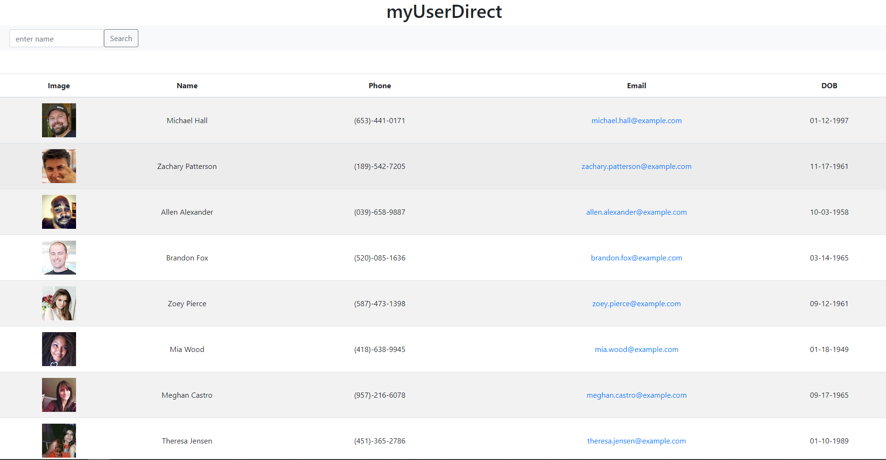

# UserDirect
An app that utilizes React to create an easy to navigate employee directory. 
This project was bootstrapped with [Create React App](https://github.com/facebook/create-react-app).

## Description 
Searching an employee directory shouldn't be difficult. With myUserDirect you are able to search users, sort found users, and display non-sensitive information in a table format. 

## Features
- [x] Search employees in User Direct. 

## Learn More
Check out [Bootstrap documentation](https://getbootstrap.com/docs/4.5/getting-started/introduction/) to learn about the components utilized in this app. 

You can learn more in the [Create React App documentation](https://facebook.github.io/create-react-app/docs/getting-started).

To learn React, check out the [React documentation](https://reactjs.org/).